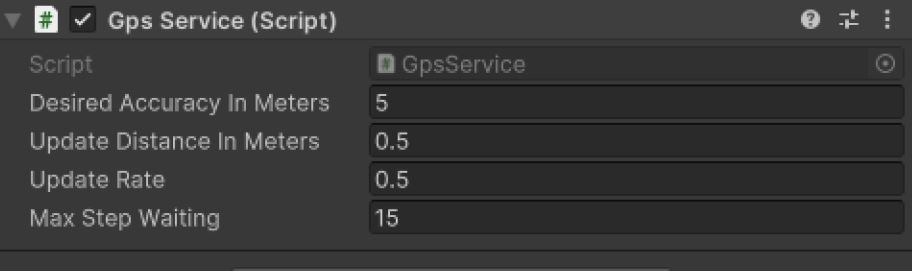
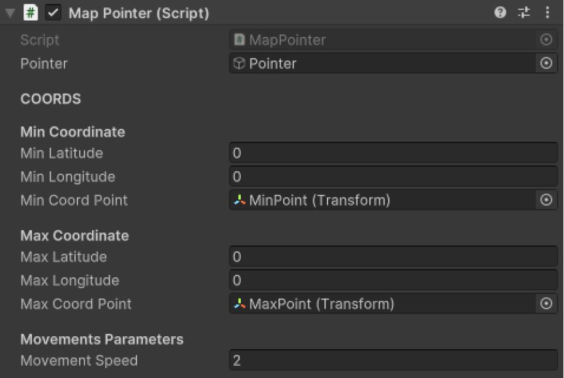
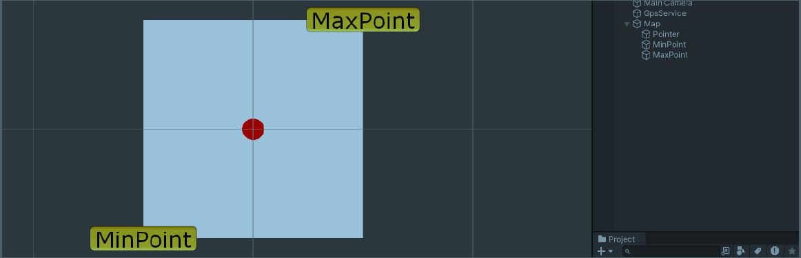

# 📍 GPS Service for Unity / Servicio GPS para Unity

**Author / Autor:** Miguel Palencia  
**Based on / Basado en:** Unity's official LocationService  
🔗 [Unity Documentation / Documentación de Unity](https://docs.unity3d.com/ScriptReference/LocationService.html)

---

## 🇬🇧 Overview

This project provides a reusable template for implementing localization functionality in Unity.  
It includes two main scripts:

- `GpsService.cs` — Manages device GPS data using Unity's location service.
- `MapPointer.cs` — Transforms real-world coordinates to positions on a game map.

---

## 🛰️ GpsService.cs

Handles the location system via a Singleton pattern, allowing easy access to GPS data across other scripts.

### 🔧 How it Works

1. Initializes the location service on startup.
2. A coroutine updates `_longitude` and `_latitude` at intervals defined by `updateRate` (in seconds).
3. If no update is received within `maxStepWaiting`, the service is restarted automatically.

### ⚙️ Location Service Parameters

- **Desired Accuracy In Meters:**  
  Lower values increase accuracy but reduce performance. Use values > 1 for balance.

- **Update Distance In Meters:**  
  Minimum distance (in meters) to trigger an update. Lower values mean better accuracy at a higher performance cost.

---

## 🗺️ MapPointer.cs

Maps real-world coordinates to in-game positions.

### 🛠️ Setup Instructions

1. **Map Assignment**  
   - Add the map image to the `SpriteRenderer` of the `Map` GameObject.

2. **Define Boundary Points**  
   - Set the `MinPoint` and `MaxPoint` GameObjects with the minimum and maximum latitude/longitude values.

3. **Additional Config**  
   - **Movement Speed:**  
     Interpolates pointer movement to avoid abrupt transitions.

---

## 🇪🇸 Descripción general

Este proyecto proporciona una plantilla reutilizable para implementar funcionalidad de localización en Unity.  
Incluye dos scripts principales:

- `GpsService.cs` — Gestiona los datos GPS del dispositivo usando el servicio de localización de Unity.
- `MapPointer.cs` — Transforma coordenadas reales a posiciones dentro del mapa del juego.

---

## 🛰️ GpsService.cs

Gestiona el sistema de localización con un patrón Singleton para facilitar el acceso desde otros scripts.

### 🔧 Funcionamiento

1. Inicializa el servicio de localización al inicio.
2. Una corrutina actualiza `_longitude` y `_latitude` según `updateRate` (en segundos).
3. Si no se obtiene una actualización en `maxStepWaiting`, el servicio se reinicia automáticamente.

### ⚙️ Parámetros del servicio

- **Desired Accuracy In Meters (Precisión deseada):**  
  Valores bajos aumentan la precisión pero afectan el rendimiento. Se recomienda un valor > 1.

- **Update Distance In Meters (Distancia mínima para actualizar):**  
  Menor distancia mejora la precisión pero incrementa el coste en rendimiento.

---

## 🗺️ MapPointer.cs

Convierte coordenadas reales del dispositivo a una posición dentro del juego.

### 🛠️ Instrucciones de configuración

1. **Asignación del mapa**  
   - Añade la imagen del mapa al componente `SpriteRenderer` del objeto `Map`.

2. **Definir puntos límite**  
   - Configura los GameObjects `MinPoint` y `MaxPoint` con las coordenadas mínimas y máximas (latitud y longitud).

3. **Configuración adicional**  
   - **Movement Speed (Velocidad de movimiento):**  
     Usa interpolación para suavizar el movimiento del puntero y evitar teletransportaciones.

---

## 📚 References / Referencias

- [Unity LocationService Documentation / Documentación de LocationService de Unity](https://docs.unity3d.com/ScriptReference/LocationService.html)
